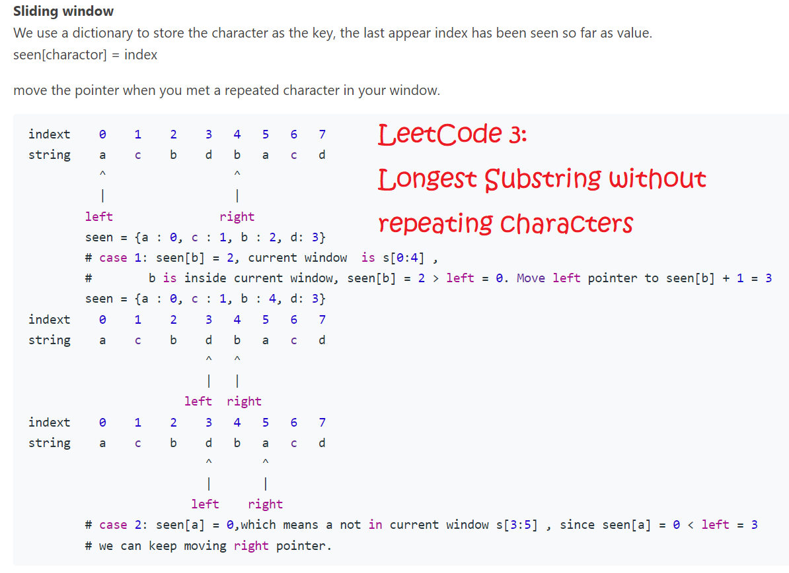

# LeetCode-Notes
Here I will record all the useful information that I learned or gained from praticing LeetCode problems

Note: :heavy_check_mark: means **very important, typical, or good examples** that should definitely be familiar with

## Functions and Methods
### Binary Tree Traversals and Operations (Usually with Recursion)


```
def preorder(root):
  return [root.val] + preorder(root.left) + preorder(root.right) if root else []
  
def inorder(root):
  return  inorder(root.left) + [root.val] + inorder(root.right) if root else []
  
def postorder(root):
  return  postorder(root.left) + postorder(root.right) + [root.val] if root else []
```
About **Top-down** and **Bottom-up** recursions: [link](https://leetcode.com/explore/learn/card/data-structure-tree/17/solve-problems-recursively/534/)

```
# Top-down maximum_depth(root, depth)

1. return if root is null
2. if root is a leaf node:
3.     answer = max(answer, depth)         // update the answer if needed
4. maximum_depth(root.left, depth + 1)     // call the function recursively for left child
5. maximum_depth(root.right, depth + 1)    // call the function recursively for right child

# Bottom-up maximum_depth(root, depth)

1. return 0 if root is null                 // return 0 for null node
2. left_depth = maximum_depth(root.left)
3. right_depth = maximum_depth(root.right)
4. return max(left_depth, right_depth) + 1  // return depth of the subtree rooted at root
```

About **General Ideas of Recursion**:
```
1. Define stopping conditions (and return)
2. Assuming the recursion function works perfectly, get results of current stage
3. Going up one layer by considering the current stage's result and updating it accordingly (assuming results from Step-2 perfect)
```

:heavy_check_mark: [94. Binary Tree Inorder Traversal](https://leetcode.com/problems/binary-tree-inorder-traversal/)

[101. Symmetric Tree](https://leetcode.com/problems/symmetric-tree/): check if tree is symmetric (mirrored)

[104. Maximum Depth of Binary Tree](https://leetcode.com/problems/maximum-depth-of-binary-tree/)

[617. Merge Two Binary Trees](https://leetcode.com/problems/merge-two-binary-trees/)

:heavy_check_mark: [543. Diameter of Binary Tree](https://leetcode.com/problems/diameter-of-binary-tree/)

[226. Invert Binary Tree](https://leetcode.com/problems/invert-binary-tree/)

[102. Binary Tree Level Order Traversal](https://leetcode.com/problems/binary-tree-level-order-traversal/): (NOT using recursion)

[95. Unique Binary Search Trees II](https://leetcode.com/problems/unique-binary-search-trees-ii/): (Advanced version of 102, quite complicated)

---
### Dynamic Programming

```
# To generate a 2D array of dimension m * n:
dp = [[0]*n for i in range(m)]
```

[70. Climbing Stairs](https://leetcode.com/problems/climbing-stairs/): dynamic programming to find number of ways to climb to a stair

[139. Word Break](https://leetcode.com/problems/word-break/): check if word can be broken down to elements in a word dictionary

:heavy_check_mark: [22. Generate Parentheses](https://leetcode.com/problems/generate-parentheses/): generate all combinations of well-formed parentheses from given number of pairs

[62. Unique Paths](https://leetcode.com/problems/unique-paths/): all unique paths from top-left corner of a grid to bottom-right

[64. Minimum Path Sum](https://leetcode.com/problems/minimum-path-sum/): minimum path from top-left corner of a grid to bottom-right

---
### Binary Search


[35. Search Insert Position](https://leetcode.com/problems/search-insert-position/): binary search on list index

:heavy_check_mark: [74. Search a 2D Matrix](https://leetcode.com/problems/search-a-2d-matrix/): double binary search on 2D array / matrix

---
### Kadane's Algorithm (Maximum Subarray)
```
# The thought follows a simple rule:
# If the sum of a subarray is positive, it has possible to make the next value bigger, so we keep do it until it turn to negative.
# If the sum is negative, it has no use to the next element, so we break.
# it is a game of sum, not the elements.

Initialize:
    max_so_far = INT_MIN
    max_ending_here = 0

Loop for each element of the array
  (a) max_ending_here = max_ending_here + a[i]
  (b) if(max_so_far < max_ending_here)
            max_so_far = max_ending_here
  (c) if(max_ending_here < 0)
            max_ending_here = 0
return max_so_far
```

:heavy_check_mark: [53. Maximum Subarray](https://leetcode.com/problems/maximum-subarray/): find subarray whose sum is maximized

---
### Bit Operations (Including Kernighan's Algorithm - which is a DP algorithm)
About Python **Bitwise Operators**: [link](https://wiki.python.org/moin/BitwiseOperators) (<<, >>, &, |, ~, and ^)

About **Kernighan's Algorithm**: [link](https://iq.opengenus.org/brian-kernighan-algorithm/)

```
def Kenighan_algo(n):
    cnt = 0
    while n != 0 :
        cnt += 1 # Each iteration will count one 1 digit in n
        n = n & n-1 # unsets the right most set bit
           
    return cnt

# Patterns:
# i= 1 ( 1 &  0 =  0)     1 &     0 =     0  n_ones =  1
# i= 2 ( 2 &  1 =  0)    10 &     1 =     0  n_ones =  1
# i= 3 ( 3 &  2 =  2)    11 &    10 =    10  n_ones =  2
# i= 4 ( 4 &  3 =  0)   100 &    11 =     0  n_ones =  1
# i= 5 ( 5 &  4 =  4)   101 &   100 =   100  n_ones =  2
# i= 6 ( 6 &  5 =  4)   110 &   101 =   100  n_ones =  2
# i= 7 ( 7 &  6 =  6)   111 &   110 =   110  n_ones =  3
# i= 8 ( 8 &  7 =  0)  1000 &   111 =     0  n_ones =  1
# i= 9 ( 9 &  8 =  8)  1001 &  1000 =  1000  n_ones =  2
# i=10 (10 &  9 =  8)  1010 &  1001 =  1000  n_ones =  2
```

[191. Number of 1 Bits](https://leetcode.com/problems/number-of-1-bits/): count number of 1 in a bit string

:heavy_check_mark: [338. Counting Bits](https://leetcode.com/problems/counting-bits/): count number of 1 for binary representation of integers up to a limit (dynamic programming)

---
### Depth First Search (DFS) / Recursion / Backtracking

**General Backtracking Questions and Template**: [link-1](https://leetcode.com/problems/combination-sum/discuss/429538/General-Backtracking-questions-solutions-in-Python-for-reference-%3A), [link-2](https://leetcode.com/problems/letter-combinations-of-a-phone-number/discuss/780232/Backtracking-Python-problems%2B-solutions-interview-prep)

**General Idea**: 
1. Transform problem into a **tree problem**
2. Use "candidates" to track the set of leaf nodes under current node
3. Use "path" to track the path taken to reach the current node in the tree
4. Use "res" to save all the paths.
5. Use "target" to keep track of current progress and the limits


```
# Base Function

def combine(n, target):
    res = []
    candidates = range(1, n+1)
    dfs(candidates, target, 0, [], res)
    return res
    
########################################################################################################    
# Combinations: combinations of list [candidates] that form a size [target] window with duplicates, e.g. [1,1] (See LeetCode 77)

def dfs(candidates, target, path, res):
    # candidates: leaf nodes under current node
    # target: our restriction (that the size of considered nodes should be equal to [target])
    # path: current path down the entire tree
    # res: to save all the paths
    
    if target < 0:  # backtracking WITHOUT appending the path to res (we went too far) 
        return 
        
    if target == 0:
        res.append(path)
        return # backtracking AFTER appending path to res (we met target)
        
    for i in range(len(candidates)):
        # Note the candidates[i+1:] here - we only consider candidates AFTER current node
        # effect: remove duplicates ([3,5] = [5,3]), and to remove itself ([3,3])
        # since nodes [:i] prior to i are already considered when traversing trees with root = prior nodes
        # also we don't want selections like [3,3] because that is combination of an element with itself, invalid
        dfs(candidates[i+1:], target-1, path+[candidates[i]], res)
        
########################################################################################################
# Combination Sum: UNIQUE combinations of list [candidates] that sum up to [target] (See LeetCode 39)

def dfs(candidates, target, path, res):
    # candidates: leaf nodes under current node
    # target: our restriction (that the sum should be equal to [target])
    # path: current path down the entire tree
    # res: to save all the paths
    
    if target < 0:  # backtracking WITHOUT appending the path to res (we went too far)
        return  
        
    if target == 0:
        res.append(path)
        return # backtracking AFTER appending path to res (we met target)
        
    for i in range(len(candidates)):
        # Note the candidates[i:] here - we don't consider candidates prior to current node
        # since those combinations / paths are already considered when traversing trees with root = prior nodes
        # to eliminate repetition, since we wantUNIQUE combinations
        # which enforces each combination of candidates to run once (e.g., [3,5] = [5,3])
        dfs(candidates[i:], target-candidates[i], path+[candidates[i]], res)  
        
########################################################################################################
# Permutations: all permutations of list [candidates] (See LeetCode 46)

def dfs(self, candidates, path, res):
    # candidates: leaf nodes under current node
    # path: current path down the entire tree
    # res: to save all the paths
    
    if not candidates:
        res.append(path)
        return # backtracking
        
    for i in range(len(candidates)):
        # candidates[:i] + candidates[i+1:] -> all candidates but leaving out the i-th element
        # because we already included it into our path: path+[candidates[i]]
        self.dfs(candidates[:i]+candidates[i+1:], path+[candidates[i]], res)

```

:heavy_check_mark: [77. Combinations](https://leetcode.com/problems/combinations/): all possible combinations of k numbers from range 1 to n (**DFS for Combinations**)

:heavy_check_mark: [39. Combination Sum](https://leetcode.com/problems/combination-sum/): find unique combination of elements that sum to a number (**DFS for Combination Sum**)

:heavy_check_mark: [46. Permutations](https://leetcode.com/problems/permutations/): all the possible permutations of an array (**DFS for Permutations**)

:heavy_check_mark: [17. Letter Combinations of a Phone Number](https://leetcode.com/problems/letter-combinations-of-a-phone-number/): letter combinations that the numbers can form （**DFS for Combinations**）

[78. Subsets](https://leetcode.com/problems/subsets/): power set of an array of intergers

:heavy_check_mark: [79. Word Search](https://leetcode.com/problems/word-search/): see if a word can be spelled out from a matrix of letters (**Advanced Backtracking**)

[212. Word Search II](https://leetcode.com/problems/word-search-ii/)

---
### Rotate Matrix
**General Idea**: [link](https://leetcode.com/problems/rotate-image/discuss/18872/A-common-method-to-rotate-the-image)

```
/*
 * clockwise rotate
 * first reverse up to down, then swap the symmetry (transpose)
 * 1 2 3     7 8 9     7 4 1
 * 4 5 6  => 4 5 6  => 8 5 2
 * 7 8 9     1 2 3     9 6 3
*/

/*
 * anticlockwise rotate
 * first reverse left to right, then swap the symmetry
 * 1 2 3     3 2 1     3 6 9
 * 4 5 6  => 6 5 4  => 2 5 8
 * 7 8 9     9 8 7     1 4 7
*/
```

:heavy_check_mark: [48. Rotate Image](https://leetcode.com/problems/rotate-image/): rotate a matrix clockwise

---

### Sliding Window (Usually Related to Substrings)


:heavy_check_mark: [3. Longest Substring Without Repeating Characters](https://leetcode.com/problems/longest-substring-without-repeating-characters/): (using dictionary for seen\[character\] = index)

---
### List Sorting and Partitioning

**Dutch National Flag Problem**: [link](https://en.wikipedia.org/wiki/Dutch_national_flag_problem)
```
procedure three-way-partition(A : array of values, mid : value):
    i ← 0
    j ← 0
    k ← size of A - 1

    while j <= k:
        if A[j] < mid:
            swap A[i] and A[j]
            i ← i + 1
            j ← j + 1
        else if A[j] > mid:
            swap A[j] and A[k]
            k ← k - 1
        else:
            j ← j + 1
```


:heavy_check_mark: [75. Sort Colors](https://leetcode.com/problems/sort-colors/): sort list of elements 0, 1, 2 in ascending order (**Dutch National Flag Problem**)

---
## Data Structures

---
### Dictionary
[136. Single Number](https://leetcode.com/problems/single-number/): find the number in array that only appeared once (enumerating dict.items())

[17. Letter Combinations of a Phone Number](https://leetcode.com/problems/letter-combinations-of-a-phone-number/): letter combinations that the numbers can form （mapping digits to corresponding letters）


---
### Linked List
```
class ListNode(object):
   def __init__(self, x):
       self.val = x
       self.next = None
```

**Cycle finding using slow & faster pointers**: [Proof](https://drive.google.com/file/d/1ypA196eeOnzWUTQGtOh5WpedPdM3FFDd/view)

**Cycle Detection**: [Ref](https://leetcode.com/problems/linked-list-cycle-ii/discuss/1701128/C%2B%2BJavaPython-Slow-and-Fast-oror-Image-Explanation-oror-Beginner-Friendly) with proof.

```
class Solution(object):
    def detectCycle(self, head):
        slow = fast = head
        while fast and fast.next:
            slow, fast = slow.next, fast.next.next
            if slow == fast: break
        else: return None  # if not (fast and fast.next): return None
        while head != slow:
            head, slow = head.next, slow.next
        return head
```

[141. Linked List Cycle](https://leetcode.com/problems/linked-list-cycle/): find if cycle present in linked list (using walker/slow and runner/fast pointers)

:heavy_check_mark: [142. Linked List Cycle II](https://leetcode.com/problems/linked-list-cycle-ii/): find if cycle present, if so return the node at which the cyle begins

[160. Intersection of Two Linked Lists](https://leetcode.com/problems/intersection-of-two-linked-lists/): find the node at which two linked lists intersect (two pointers OR concatenate lists and find cycle)

:heavy_check_mark: [234. Palindrome Linked List](https://leetcode.com/problems/palindrome-linked-list/): check if linked list is a palindrome (using slow/fast pointers & reversing list)

:heavy_check_mark: [24. Swap Nodes in Pairs](https://leetcode.com/problems/swap-nodes-in-pairs/): using dummy nodes - **with visual guide which is super useful**

[206. Reverse Linked List](https://leetcode.com/problems/reverse-linked-list/): using dummy nodes (also including a less obvious but clever solution)

[2. Add Two Numbers](https://leetcode.com/problems/add-two-numbers/): add two linked lists that represent two numbers in reversed order

:heavy_check_mark: [19. Remove Nth Node From End of List](https://leetcode.com/problems/remove-nth-node-from-end-of-list/): (using fast/slow pointers to find n-th node from list's end)

---
### Stack
[155. Min Stack](https://leetcode.com/problems/min-stack/): design a stack that supports push, pop, top, and getMin


---
### [Collections.defaultdict](https://docs.python.org/3/library/collections.html#collections.defaultdict)

:heavy_check_mark: [494. Target Sum](https://leetcode.com/problems/target-sum/submissions/): combinations of '+' and '-' to build expression up to target sum (KEY = sum; VAL = number of ways to form this sum)

[49. Group Anagrams](https://leetcode.com/problems/group-anagrams/): group anagrams that are made of same set of letters (KEY = tuple of hashed 26 letters; VAL = list of anagrams with KEY combination of letters)

---
### [Collections.Counter](https://docs.python.org/3/library/collections.html#collections.Counter)

```
# Initialization
cnt = Counter()
    ... # Code to populate the counter (e.g., cnt[key] += value)
    ... # Or to create counter directly from list (e.g., cnt = Counter(list))

# Counter.items():
for key, val in counter.items():
    ... # key is the element, val is its count

# Counter.most_common(k):
for key, val in cnt.most_common(k):
    ... # key is the element, val is its count

```


[169. Majority Element](https://leetcode.com/problems/majority-element/): find the mode of a list (using **Counter.items()**)

[347. Top K Frequent Elements](https://leetcode.com/problems/top-k-frequent-elements/): (using **Counter.most_common(k)**)

---
