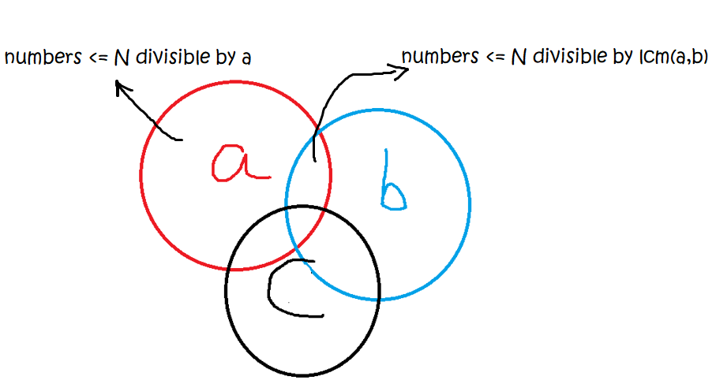

# Greatest Common Divisor (GCD) & Least Common Multiple (LCM)

## **Formulae**

```
def gcd(a, b) -> int:
    if b == 0:
        return a
    return gcd(b, a % b)
    
def lcm(a, b) -> int:
     return (a * b) / gcd(a, b)
```


## **Related Questions & Concepts**

### Example 1: :orange_book: [1201. Ugly Number III](https://leetcode.com/problems/ugly-number-iii/)



**F(N) = (total number of positive integers <= N which are divisible by a or b or c.)**

F(N) = a + b + c - a ∩ c - a ∩ b - b ∩ c + a ∩ b ∩ c

F(N) = N/a + N/b + N/c - N/lcm(a, c) - N/lcm(a, b) - N/lcm(b, c) + N/lcm(a, b, c)

```
ab = lcm(a,b)
ac = lcm(a,c)
bc = lcm(b,c)
abc = lcm(a,bc)

total = F(num) = num//a + num//b + num//c - num//ab - num//ac - num//bc + num//abc
```
