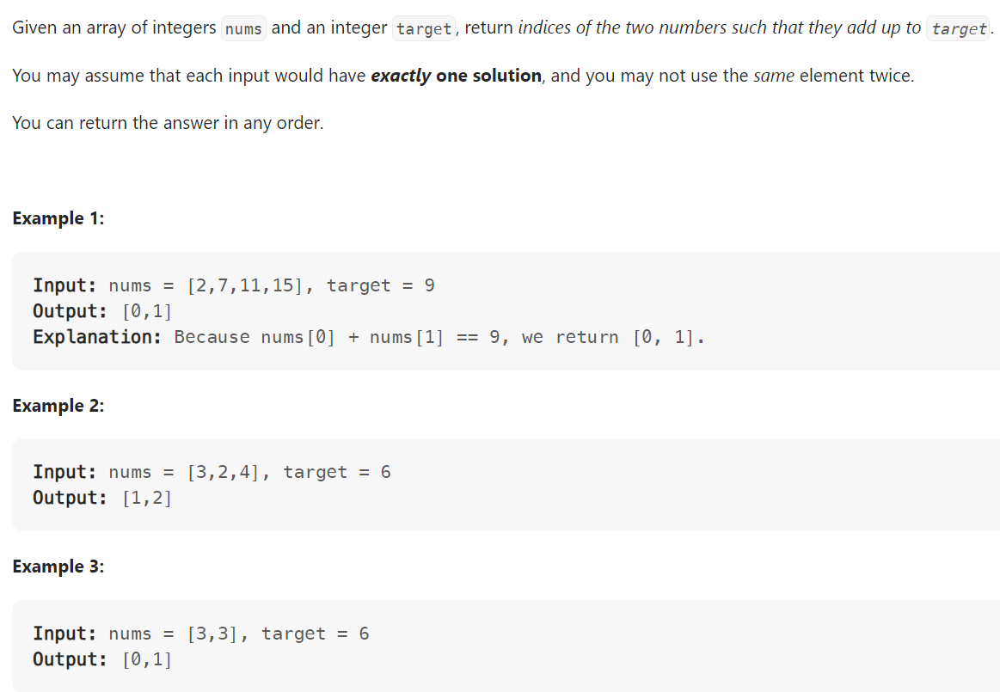

# Problem


# Solution ([Reference](https://youtu.be/KLlXCFG5TnA))
```python
class Solution:
    def twoSum(self, nums: List[int], target: int) -> List[int]:
        prev_map = {} # {value: index at which it last appeared at}

        for idx, num in enumerate(nums):
            diff = target - num
            if diff in prev_map:
                return [prev_map[diff], idx]
            else:
                prev_map[num] = idx
        
        return
```

# Complexity
```
Time = O(N)
Space = O(N)

# N = len(nums)
```