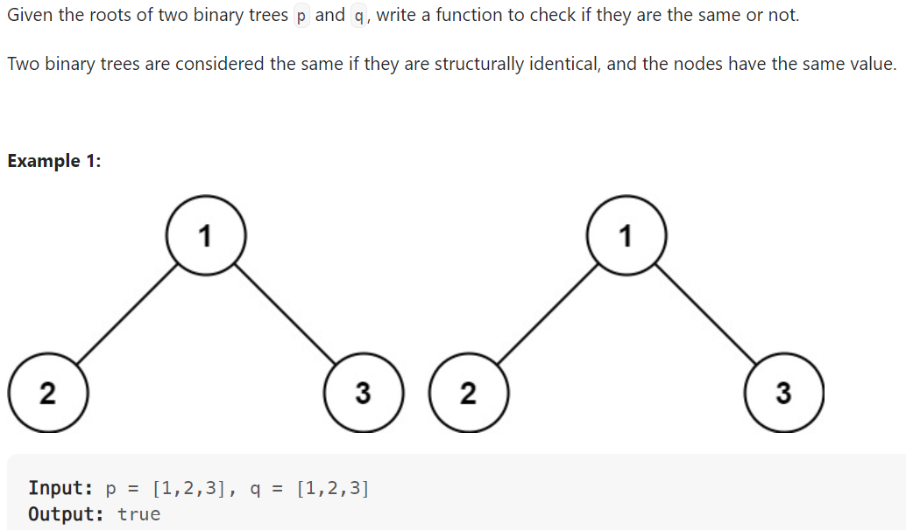

# Problem


# Solution ([Reference](https://youtu.be/vRbbcKXCxOw))
```python
# Definition for a binary tree node.
# class TreeNode:
#     def __init__(self, val=0, left=None, right=None):
#         self.val = val
#         self.left = left
#         self.right = right
class Solution:
    def isSameTree(self, p: Optional[TreeNode], q: Optional[TreeNode]) -> bool:
        if not p and not q: 
            # If both Null, they are the same
            return True
        if not p or not q:
            # If only one is Null, different
            return False 

        if p.val != q.val:
            return False
        else:
            # Check if left subtrees are the same AND right subtrees are the same
            return self.isSameTree(p.left, q.left) and self.isSameTree(p.right, q.right)
```

# Complexity
```
Time = O(|p| + |q|)
```