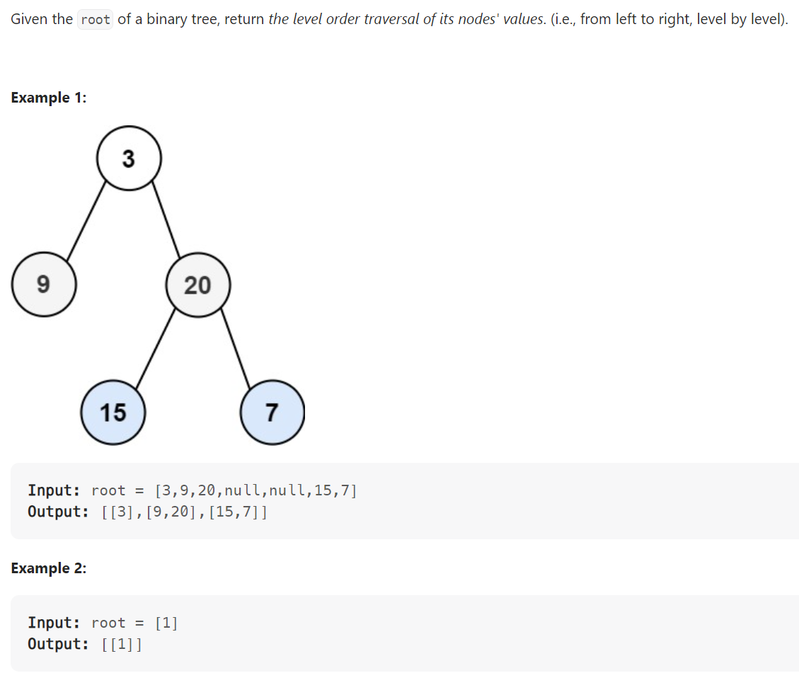

# Problem


# Solution ([Reference](https://youtu.be/6ZnyEApgFYg))
```python
# Definition for a binary tree node.
# class TreeNode:
#     def __init__(self, val=0, left=None, right=None):
#         self.val = val
#         self.left = left
#         self.right = right
class Solution:
    def levelOrder(self, root: Optional[TreeNode]) -> List[List[int]]:
        if not root:
            return None
        if not root.left and not root.right:
            return [[root.val]]

        result = []
        queue = collections.deque([root])

        while queue:
            result.append([node.val for node in queue])

            for i in range(len(queue)):
                node = queue.popleft()
                if node.left:
                    queue.append(node.left)
                if node.right:
                    queue.append(node.right)

        return result
```

# Complexity
```
Time = O(N)

# N = number of nodes in the BST
```