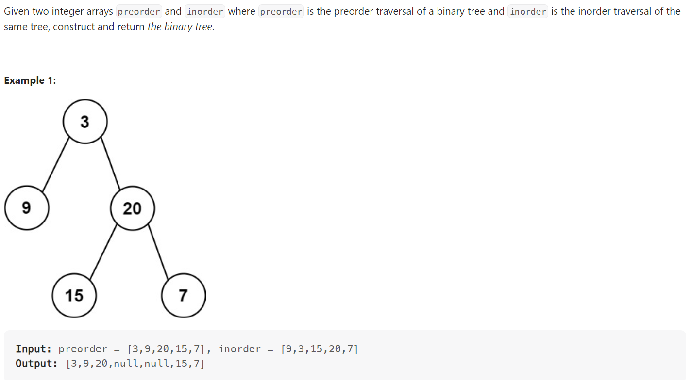

# Problem


# Solution ([Reference](https://youtu.be/ihj4IQGZ2zc), [Visualization](https://leetcode.com/problems/construct-binary-tree-from-preorder-and-inorder-traversal/solutions/34579/comments/32947))
```python
# Definition for a binary tree node.
# class TreeNode:
#     def __init__(self, val=0, left=None, right=None):
#         self.val = val
#         self.left = left
#         self.right = right
class Solution:
    def buildTree(self, preorder: List[int], inorder: List[int]) -> Optional[TreeNode]:
        if not preorder or not inorder:
            return None

        root = TreeNode(preorder[0])
        idx = inorder.index(preorder[0])
        root.left = self.buildTree(preorder[1 : idx + 1], inorder[:idx])
        root.right = self.buildTree(preorder[idx + 1 :], inorder[idx + 1:])

        return root
```

# Complexity
```
Time = O(N)

# N = number of nodes in the BST
```