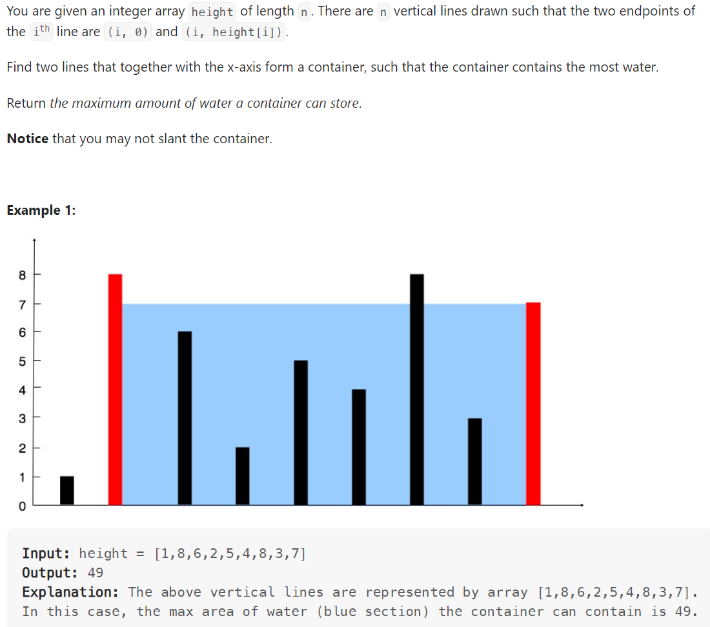

# Problem


# Solution ([Reference](https://youtu.be/UuiTKBwPgAo))
```python
class Solution:
    def maxArea(self, height: List[int]) -> int:
        result = 0
        left, right = 0, len(height) - 1

        while left < right:
            area = min(height[left], height[right]) * (right - left)
            result = max(result, area)

            # Shift the pointer with minimum height
            if height[left] < height[right]:
                left += 1
            else:
                right -= 1
        
        return result
```

# Complexity
```
Time = O(N)
Space = O(1)

# N = len(height)
```