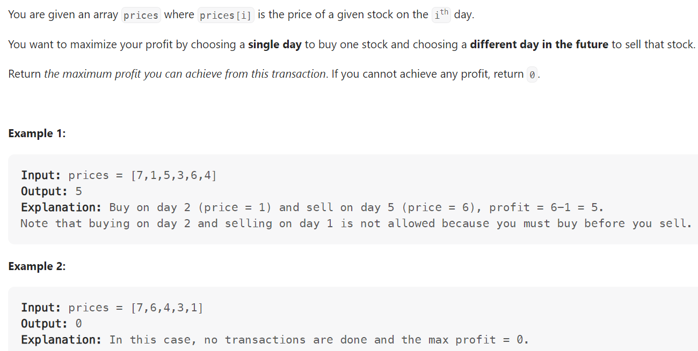

# Problem


# Solution ([Reference](https://youtu.be/1pkOgXD63yU))
```python
class Solution:
    def maxProfit(self, prices: List[int]) -> int:
        result = 0
        # left = buy, right = sell
        left, right = 0, 1 

        while right < len(prices):
            if prices[left] < prices[right]:
                # If profitable
                profit = prices[right] - prices[left]
                result = max(result, profit)
            else:
                # Ensure left pointer at minimum (in this case, right)
                left = right 
            right += 1
        
        return result

```

# Complexity
```
Time = O(N)
Space = O(1)

# N = len(prices)
```