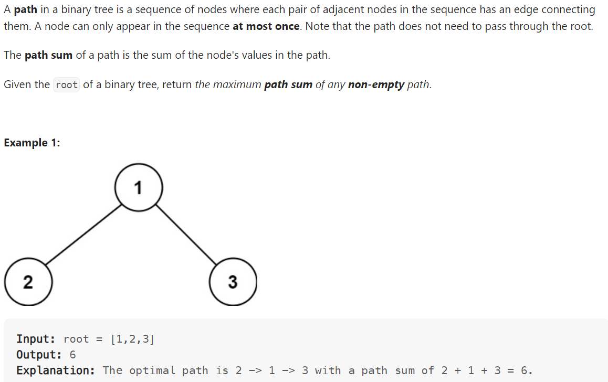

# Problem


# Solution ([Reference](https://youtu.be/Hr5cWUld4vU))
```python
# Definition for a binary tree node.
# class TreeNode:
#     def __init__(self, val=0, left=None, right=None):
#         self.val = val
#         self.left = left
#         self.right = right
class Solution:
    def maxPathSum(self, root: Optional[TreeNode]) -> int:
        self.result = float('-inf')

        # Return: longest path without splitting
        def dfs(node):
            if not node:
                return 0

            # Note: we don't want any negative numbers to hurt us
            left_max = max(dfs(node.left), 0)
            right_max = max(dfs(node.right), 0)

            self.result = max(self.result, node.val + left_max + right_max)

            return node.val + max(left_max, right_max)
        
        dfs(root)
        return self.result
```

# Complexity
```
Time = O(N)

# N = number of nodes in the BST
```