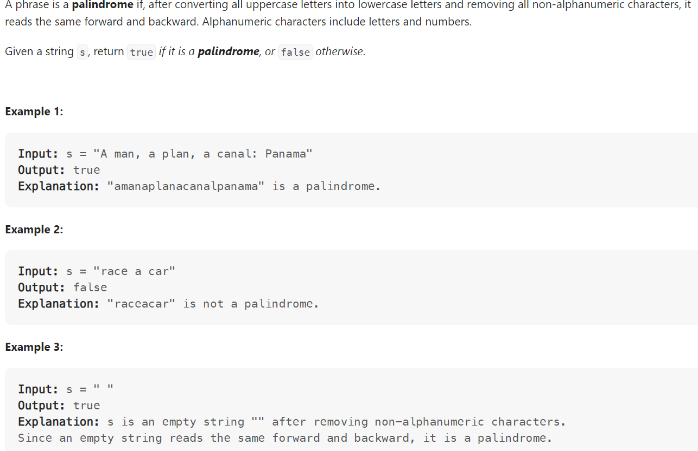

# Problem


# Solution ([Reference](https://youtu.be/jJXJ16kPFWg))
```python
class Solution:
    def isPalindrome(self, s: str) -> bool:

        """
        Alternative Solution:
            >> Transform string to alphanumeric, compare with its reverse
        """

        left, right = 0, len(s) - 1

        while left < right:
            while left < right and not self.isAlphaNum(s[left]):
                left += 1
            while left < right and not self.isAlphaNum(s[right]):
                right -= 1
            if s[left].lower() != s[right].lower():
                return False
            left += 1
            right -= 1
        
        return True

    def isAlphaNum(self, c):
        return ((ord('A') <= ord(c) <= ord('Z')) or 
                (ord('a') <= ord(c) <= ord('z')) or 
                (ord('0') <= ord(c) <= ord('9')))
```

# Complexity
```
Time = O(N)
Space = O(1)

# N = len(s)
```