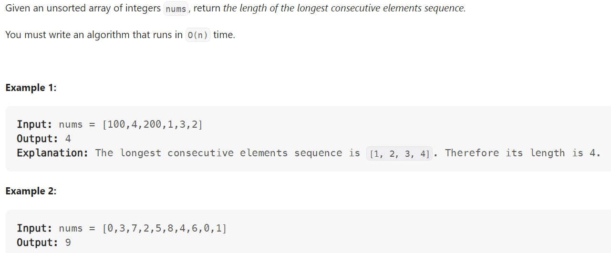

# Problem


# Solution ([Reference](https://youtu.be/vzdNOK2oB2E))
```python
class Solution:
    def longestConsecutive(self, nums: List[int]) -> int:
        num_set = set(nums)
        longest = 0

        for num in nums:
            if (num - 1) not in num_set: 
                # this is the start of a potential sequence
                length = 0
                while (num + length) in num_set:
                    length += 1
                longest = max(longest, length)
        
        return longest
```

# Complexity
```
Time = O(N)
Space = O(N)

# N = len(nums)
```