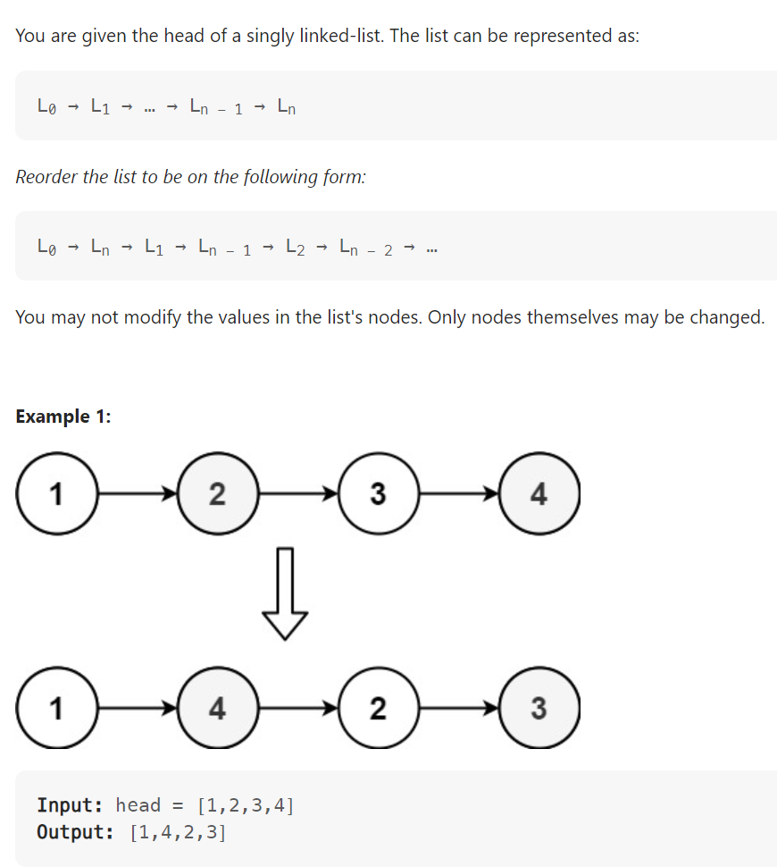

# Problem


# Solution ([Reference](https://youtu.be/S5bfdUTrKLM))
```python
# Definition for singly-linked list.
# class ListNode:
#     def __init__(self, val=0, next=None):
#         self.val = val
#         self.next = next
class Solution:
    def reorderList(self, head: Optional[ListNode]) -> None:
        """
        Do not return anything, modify head in-place instead.
        """

        # Find the middle point to split the linked list
        slow, fast = head, head.next
        while fast and fast.next:
            slow = slow.next
            fast = fast.next.next
        
        second = slow.next
        slow.next = None # Splitting the halves
        
        # Reverse the second half
        prev = None
        while second:
            temp = second.next
            second.next = prev
            prev = second
            second = temp

        # Merge the two halves
        first, second = head, prev
        while second:
            temp1, temp2 = first.next, second.next
            first.next = second
            second.next = temp1
            first, second = temp1, temp2
```

# Complexity
```
Time = O(N)
Space = O(1)

# N = len(LinkedList)
```