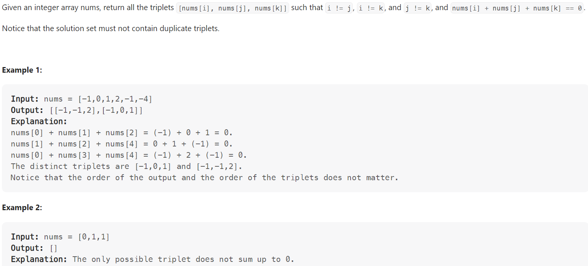

# Problem


# Solution ([Reference](https://youtu.be/jzZsG8n2R9A))
```python
class Solution:
    def threeSum(self, nums: List[int]) -> List[List[int]]:
        result = []
        nums.sort()

        # Fix the first number, and then use Two Pointers for the latter two numbers
        for first_idx in range(len(nums) - 2):
            if first_idx > 0 and nums[first_idx] == nums[first_idx - 1]:
                # Skip duplicates
                continue
            
            left, right = first_idx + 1, len(nums) - 1
            while left < right:
                three_sum = nums[first_idx] + nums[left] + nums[right]
                if three_sum > 0:
                    right -= 1
                elif three_sum < 0:
                    left += 1
                else:
                    result.append([nums[first_idx], nums[left], nums[right]])
                    left += 1
                    right -= 1

                    # Update pointers and skip duplicates
                    while left < right and nums[left] == nums[left - 1]:
                        left += 1
                    while left < right and nums[right] == nums[right + 1]:
                        right -= 1

        return result
```

# Complexity
```
Time = O(N^2)
Space = O(1)

# N = len(nums)
```