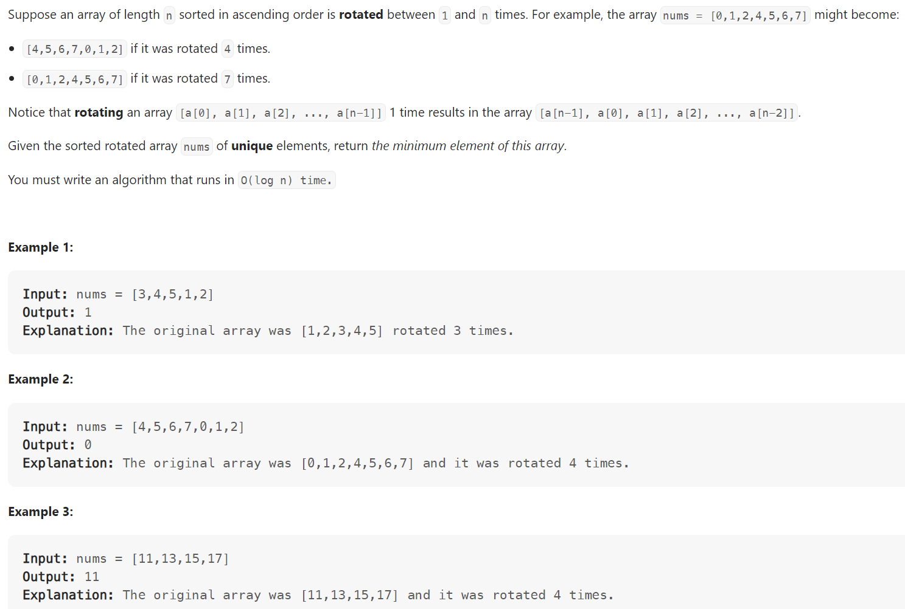

# Problem


# Solution ([Reference](https://youtu.be/nIVW4P8b1VA))
```python
class Solution:
    def findMin(self, nums: List[int]) -> int:
        left, right = 0, len(nums) - 1

        while left + 1 < right:
            mid = (left + right) >> 1

            if nums[mid] >= nums[right]:
                # Result is to the right
                left = mid
            else:
                # Result is to the left
                right = mid
        
        return min(nums[left], nums[right])
```

# Complexity
```
Time = O(N)
Space = O(1)

# N = len(nums)
```