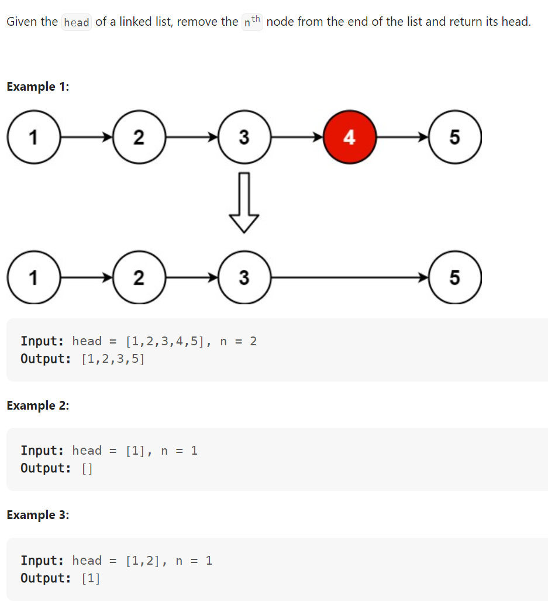

# Problem


# Solution ([Reference](https://youtu.be/XVuQxVej6y8))
```python
# Definition for singly-linked list.
# class ListNode:
#     def __init__(self, val=0, next=None):
#         self.val = val
#         self.next = next
class Solution:
    def removeNthFromEnd(self, head: Optional[ListNode], n: int) -> Optional[ListNode]:

        slow, fast = head, head

        for _ in range(n):
            fast = fast.next
        
        if not fast:
            # Special case: removing the first node
            return head.next

        while fast and fast.next:
            slow = slow.next
            fast = fast.next

        # Removing the node
        slow.next = slow.next.next
        return head
```

# Complexity
```
Time = O(N)
Space = O(1)

# N = len(LinkedList)
```