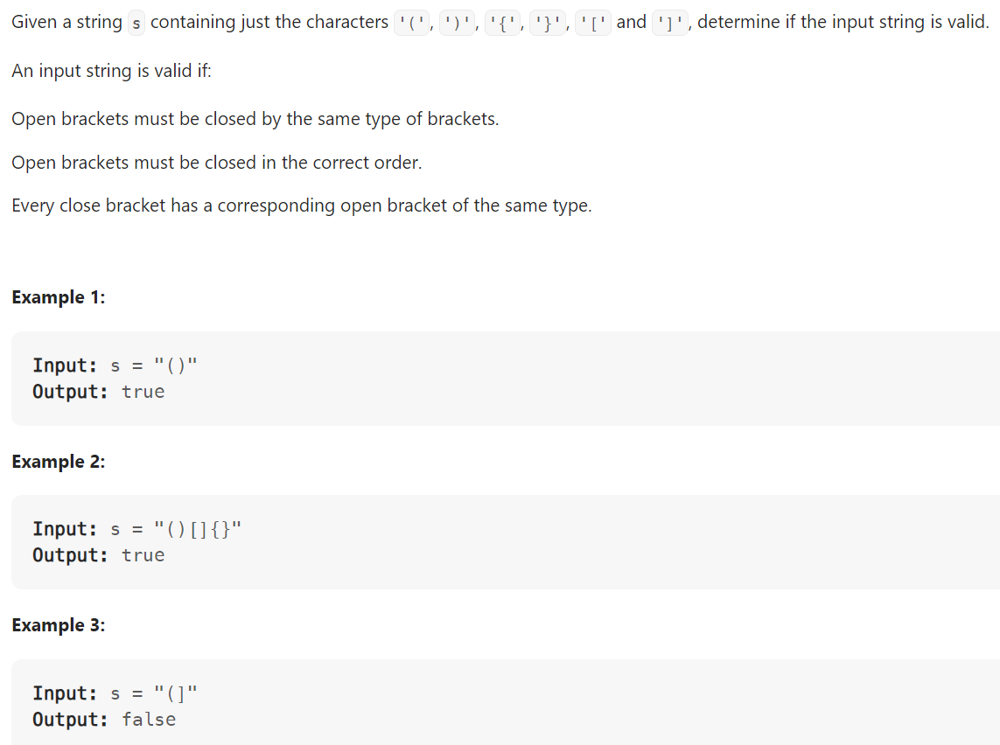

# Problem


# Solution ([Reference](https://youtu.be/WTzjTskDFMg))
```python
class Solution:
    def isValid(self, s: str) -> bool:
        mapping = {'(': ')', '[': ']', '{': '}'}
        stack = []

        for c in s:
            if c in mapping:
                # Opening bracket
                stack.append(c)
            else:
                # Closing bracket
                if len(stack) == 0:
                    # We cannot have just one closing bracket in stack
                    return False

                val = stack.pop()
                if mapping[val] != c:
                    # Brackets not matching
                    return False
                
        return len(stack) == 0
```

# Complexity
```
Time = O(N)
Space = O(N)

# N = len(s)
```