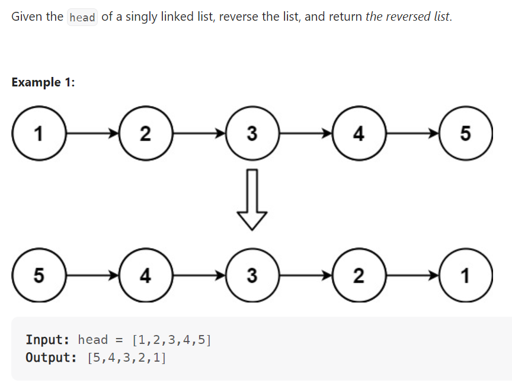

# Problem


# Solution ([Reference](https://youtu.be/G0_I-ZF0S38))
```python
# Definition for singly-linked list.
# class ListNode:
#     def __init__(self, val=0, next=None):
#         self.val = val
#         self.next = next
class Solution:
    def reverseList(self, head: Optional[ListNode]) -> Optional[ListNode]:
        if not head: return None
        if not head.next: return head

        prev, curr = None, head

        while curr:
            temp = curr.next
            curr.next = prev
            prev = curr
            curr = temp
        
        return prev
```

# Complexity
```
Time = O(N)
Space = O(1)

# N = len(LinkedList)
```