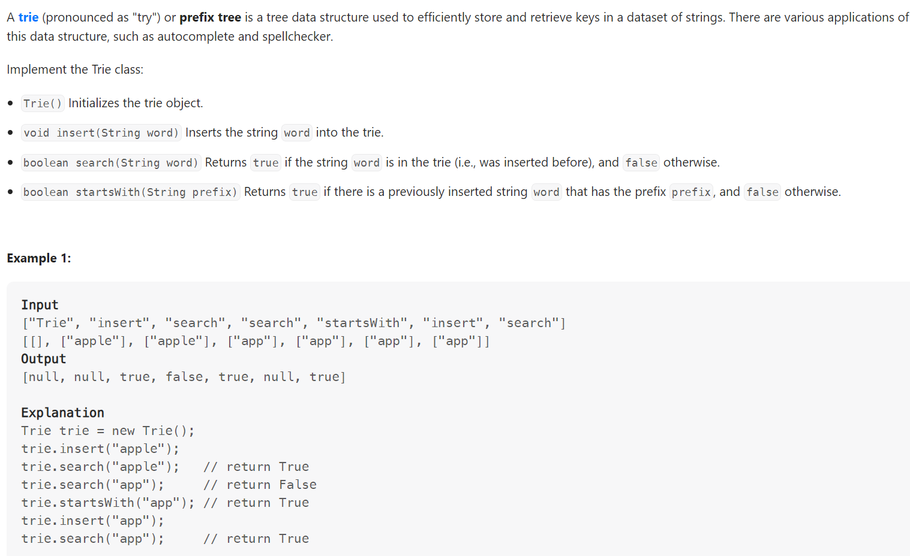

# Problem


# Solution ([Reference](https://youtu.be/oobqoCJlHA0))
```python
class TrieNode:
    def __init__(self):
        self.children = {} # {char: TrieNode()}
        self.end_of_word = False

class Trie:
    def __init__(self):
        self.root = TrieNode()

    def insert(self, word: str) -> None:
        cur = self.root

        for c in word:
            if c not in cur.children:
                # It hasn't been inserted into the Trie yet
                cur.children[c] = TrieNode()
            cur = cur.children[c]
        
        cur.end_of_word = True

    def search(self, word: str) -> bool:
        cur = self.root

        for c in word:
            if c not in cur.children:
                return False
            cur = cur.children[c]
        
        return cur.end_of_word

    def startsWith(self, prefix: str) -> bool:
        cur = self.root

        for c in prefix:
            if c not in cur.children:
                return False
            cur = cur.children[c]
        
        # At least one word starts with the prefix
        # Don't care if the prefix itself is an entire word
        return True


# Your Trie object will be instantiated and called as such:
# obj = Trie()
# obj.insert(word)
# param_2 = obj.search(word)
# param_3 = obj.startsWith(prefix)
```

# Complexity
```
```