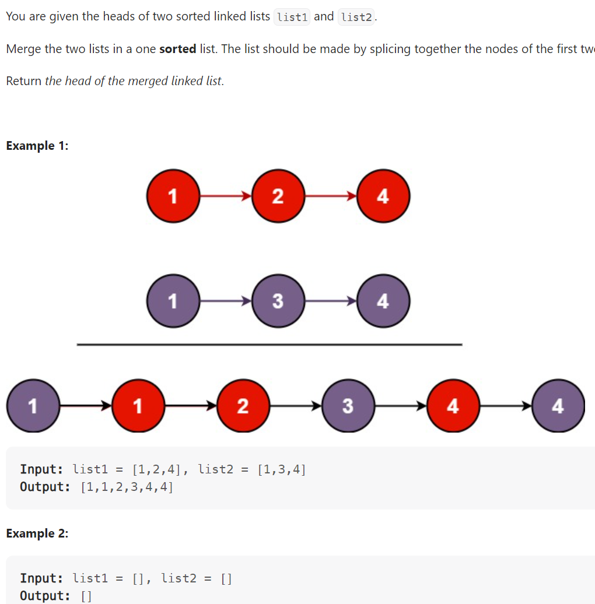

# Problem


# Solution ([Reference](https://youtu.be/XIdigk956u0))
```python
# Definition for singly-linked list.
# class ListNode:
#     def __init__(self, val=0, next=None):
#         self.val = val
#         self.next = next
class Solution:
    def mergeKLists(self, lists: List[Optional[ListNode]]) -> Optional[ListNode]:
        if not lists or len(lists) == 0:
            return None

        """
        Alternative Solution (Iterative instead of Recursive):

        while len(lists) > 1:
        # While we have more than one list, keep merging
        merged_list = []

        for i in range(0, len(lists), 2):
            # Each time we deal with a pair
            list1 = lists[i]
            list2 = lists[i + 1] if (i + 1) < len(lists) else None
            merged_list.append(self.merge_lists(list1, list2))

        lists = merged_list # merged_list contains the head node of each merged linked list pair
        """

        return lists[0]
        if not lists:
            return None
        if len(lists) == 1:
            return lists[0]

        mid = len(lists) // 2
        
        l = self.mergeKLists(lists[:mid])
        r = self.mergeKLists(lists[mid:])
        
        return self.merge_lists(l, r)
    
    def merge_lists(self, list1, list2):
        # See LeetCode 21: Merge Two Sorted Lists
        dummy = ListNode()
        tail = dummy

        while list1 and list2:
            if list1.val < list2.val:
                tail.next = list1
                list1 = list1.next
            else:
                tail.next = list2
                list2 = list2.next
            tail = tail.next
        
        if list1:
            tail.next = list1
        if list2:
            tail.next = list2
        
        return dummy.next
```

# Complexity
```
Time = O(N * log(K))

# N = len(LinkedList), K = number of LinkedLists
```