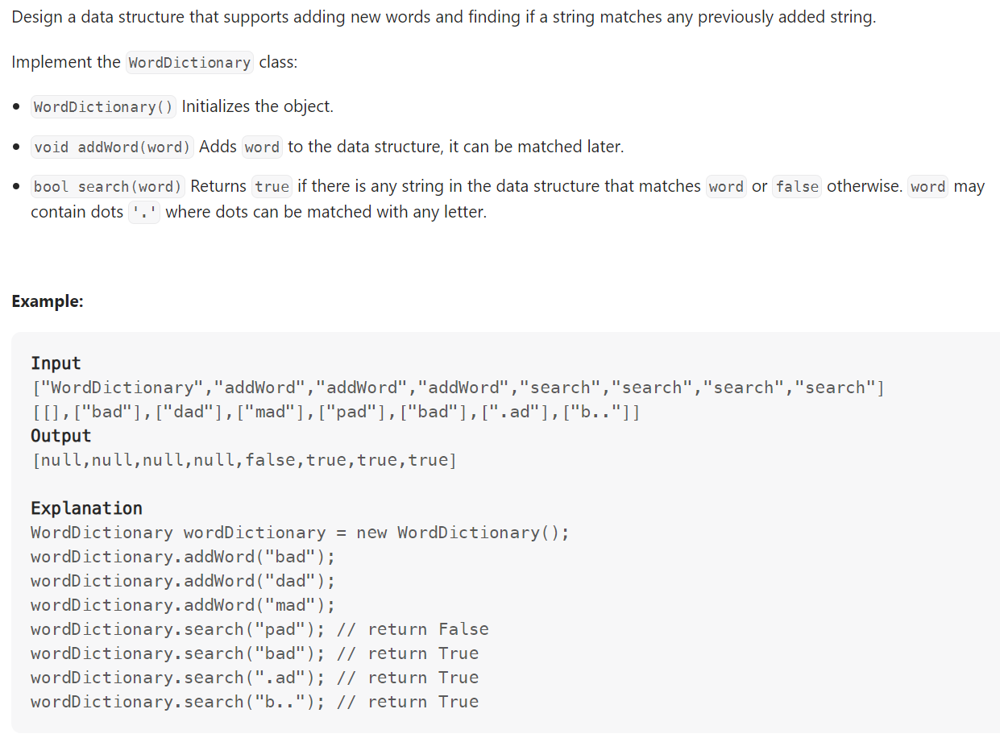

# Problem


# Solution ([Reference](https://youtu.be/BTf05gs_8iU))
```python
class TrieNode():
    def __init__(self):
        self.children = {}
        self.end_of_word = False

class WordDictionary:

    def __init__(self):
        self.root = TrieNode()

    def addWord(self, word: str) -> None:
        cur = self.root

        for c in word:
            if c not in cur.children:
                cur.children[c] = TrieNode()
            cur = cur.children[c]
        
        cur.end_of_word = True

    def search(self, word: str) -> bool:
        
        def dfs(idx, root):
            cur = root

            for i in range(idx, len(word)):
                c = word[i]
                if c == ".":
                    # Can match any char, so try each children
                    for child in cur.children.values():
                        if dfs(i + 1, child):
                            return True
                    return False
                else:
                    if c not in cur.children:
                        return False
                    cur = cur.children[c]

            return cur.end_of_word

        return dfs(0, self.root)                

# Your WordDictionary object will be instantiated and called as such:
# obj = WordDictionary()
# obj.addWord(word)
# param_2 = obj.search(word)
```

# Complexity
```
```