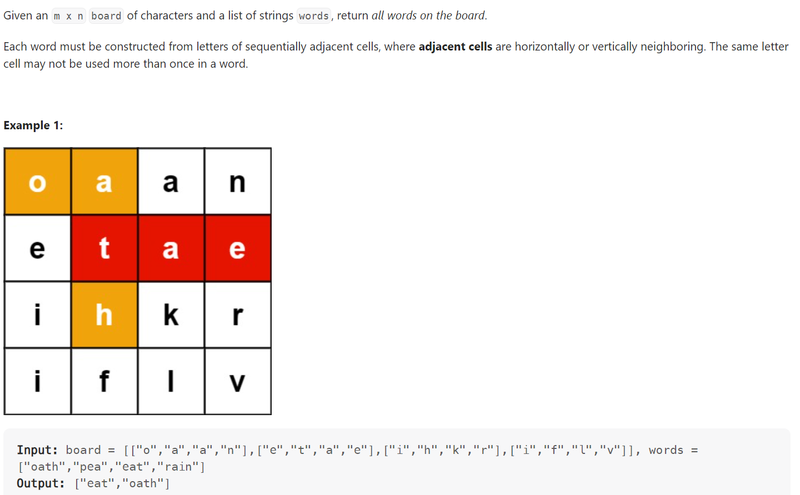

# Problem


# Solution ([Reference](https://youtu.be/asbcE9mZz_U))
```python
class TrieNode():
    def __init__(self):
        self.children = {} # <key, val> = <character, Trie nodes>
        self.end_of_word = False
        self.refs = 0 # For optimization (otherwise may TLE)
    
    def add_word(self, word):
        cur = self
        cur.refs += 1
        for c in word:
            if c not in cur.children:
                cur.children[c] = TrieNode()
            cur = cur.children[c]
            cur.refs += 1
        cur.end_of_word = True
    
    def remove_word(self, word):
        cur = self
        cur.refs -= 1
        for c in word:
            if c in cur.children:
                cur = cur.children[c]
                cur.refs -= 1

class Solution:
    def findWords(self, board: List[List[str]], words: List[str]) -> List[str]:
        root = TrieNode()
        for word in words:
            root.add_word(word)

        ROWS, COLS = len(board), len(board[0])
        result, visited = set(), set()

        def dfs(row, col, node, word):
            if row < 0 or row >= ROWS or col < 0 or col >= COLS:
                return
            if (row, col) in visited:
                return
            if board[row][col] not in node.children:
                return
            if node.children[board[row][col]].refs < 1:
                return

            visited.add((row, col))

            node = node.children[board[row][col]]
            word += board[row][col]
            if node.end_of_word:
                node.end_of_word = False # For optimization (otherwise may TLE)
                result.add(word)
                root.remove_word(word) # For optimization (otherwise may TLE)
            
            dfs(row + 1, col, node, word)
            dfs(row - 1, col, node, word)
            dfs(row, col + 1, node, word)
            dfs(row, col - 1, node, word)

            visited.remove((row, col))

        for row in range(ROWS):
            for col in range(COLS):
                dfs(row, col, root, "")
        
        return list(result)
```

# Complexity
```
```