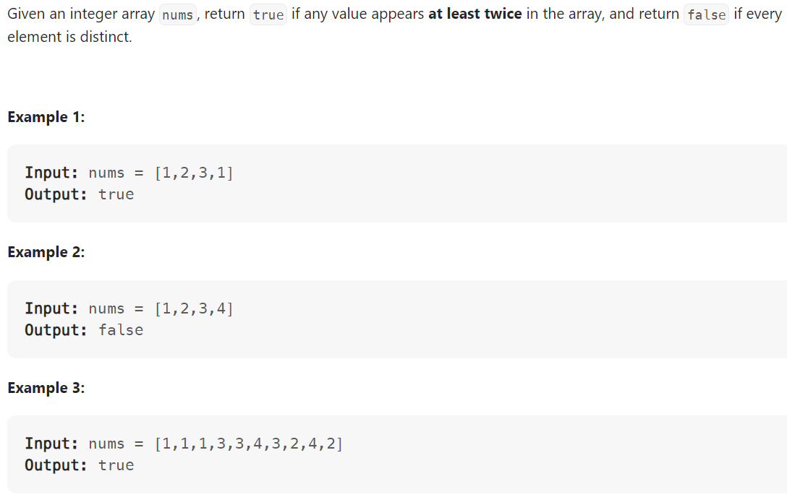

# Problem


# Solution ([Reference](https://youtu.be/3OamzN90kPg))
```python
class Solution:
    def containsDuplicate(self, nums: List[int]) -> bool:
        hashset = set()

        for num in nums:
            if num in hashset:
                return True
            else:
                hashset.add(num)
        
        return False
```

# Complexity
```
Time = O(N)
Space = O(N)

# N = len(nums)
```