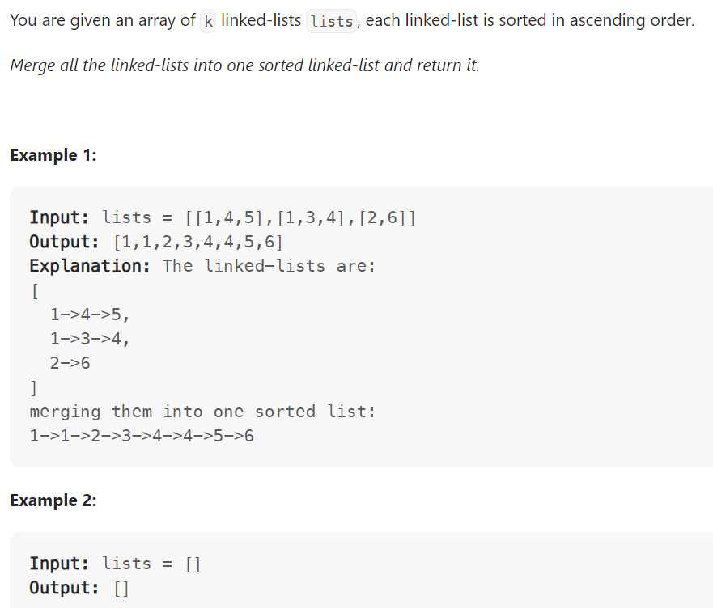

# Problem


# Solution ([Reference](https://youtu.be/q5a5OiGbT6Q))
```python
# Definition for singly-linked list.
# class ListNode:
#     def __init__(self, x):
#         self.val = x
#         self.next = None

class Solution:
    def hasCycle(self, head: Optional[ListNode]) -> bool:
        if not head: return False
        
        slow, fast = head, head.next

        while fast and fast.next:
            slow = slow.next
            fast = fast.next.next
            if slow == fast:
                return True
        
        return False
```

# Complexity
```
Time = O(N)
Space = O(1)

# N = len(LinkedList)
```