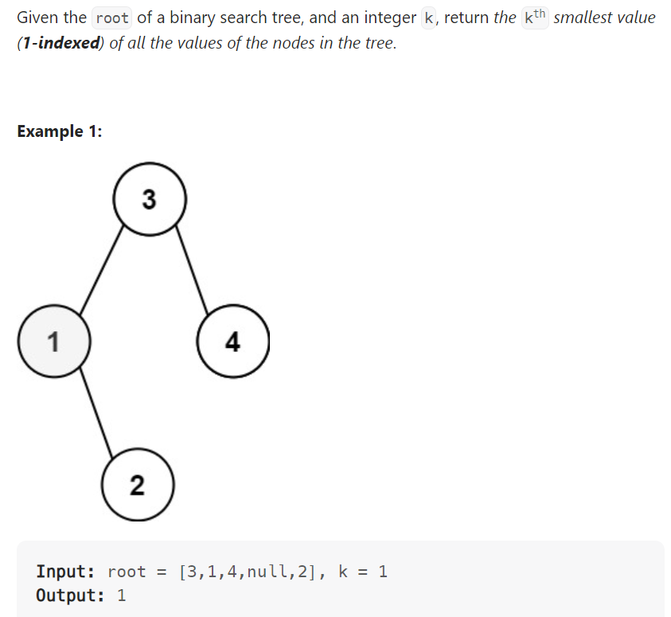

# Problem


# Solution ([Reference](https://youtu.be/5LUXSvjmGCw))
```python
# Definition for a binary tree node.
# class TreeNode:
#     def __init__(self, val=0, left=None, right=None):
#         self.val = val
#         self.left = left
#         self.right = right
class Solution:
    def kthSmallest(self, root: Optional[TreeNode], k: int) -> int:
        result = []
        
        def in_order(node):
            if node:
                in_order(node.left)
                result.append(node.val)
                in_order(node.right)
        
        in_order(root)
        result = list(set(result))
        
        return result[k - 1]
```

# Complexity
```
Time = O(N)

# N = number of nodes in the BST
```