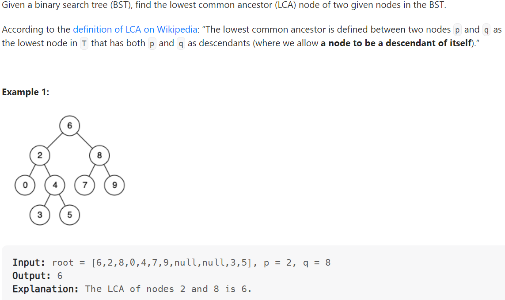

# Problem


# Solution ([Reference](https://youtu.be/gs2LMfuOR9k))
```python
# Definition for a binary tree node.
# class TreeNode:
#     def __init__(self, x):
#         self.val = x
#         self.left = None
#         self.right = None

class Solution:
    def lowestCommonAncestor(self, root: 'TreeNode', p: 'TreeNode', q: 'TreeNode') -> 'TreeNode':
        cur = root
        
        while cur:
            if p.val > cur.val and q.val > cur.val:
                # Current too small, go right
                cur = cur.right
            elif p.val < cur.val and q.val < cur.val:
                # Current too large, go left
                cur = cur.left
            else:
                return cur
```

# Complexity
```
Time = O(log(N))

# N = number of nodes in the BST
```