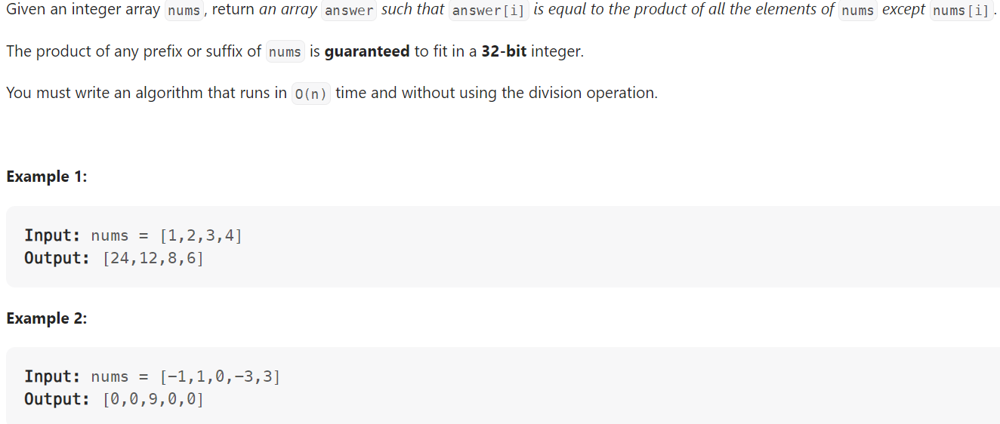

# Problem


# Solution ([Reference](https://youtu.be/bNvIQI2wAjk))
```python
class Solution:
    def productExceptSelf(self, nums: List[int]) -> List[int]:
        result = [0] * len(nums)

        prefix = 1
        for i in range(len(nums)):
            result[i] = prefix
            prefix *= nums[i]
        
        postfix = 1
        for i in range(len(nums) - 1, -1, -1):
            result[i] *= postfix
            postfix *= nums[i]
        
        return result
```

# Complexity
```
Time = O(N)
Space = O(1)

# N = len(nums)
```