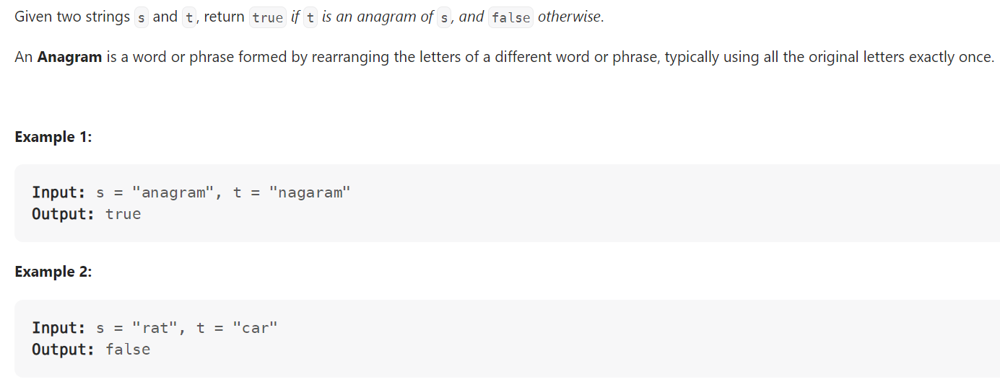

# Problem


# Solution ([Reference](https://youtu.be/9UtInBqnCgA))
```python
from collections import defaultdict, Counter

class Solution:
    def isAnagram(self, s: str, t: str) -> bool:
        
        """
        Alternative Solutions:
            >> return Counter(s) == Counter(t)
            >> return sorted(s) == sorted(t)
        """
        
        if len(s) != len(t):
            # If length differs, cannot be anagram
            return False
        
        s_count, t_count = defaultdict(int), defaultdict(int)

        for i in range(len(s)):
            s_count[s[i]] += 1
            t_count[t[i]] += 1
        
        return s_count == t_count
```

# Complexity
```
Time = O(S)
Space = O(S + T)

# S = len(S); T = len(T)
```