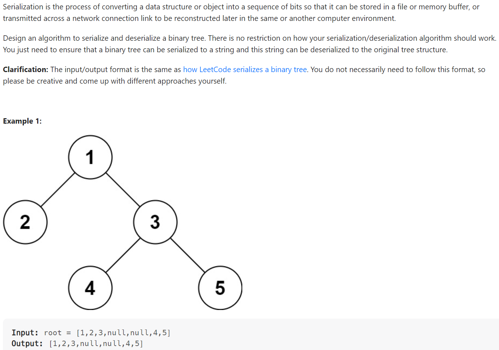

# Problem


# Solution ([Reference](https://youtu.be/u4JAi2JJhI8))
```python
# Definition for a binary tree node.
# class TreeNode(object):
#     def __init__(self, x):
#         self.val = x
#         self.left = None
#         self.right = None

class Codec:

    def serialize(self, root):
        """Encodes a tree to a single string.
        
        :type root: TreeNode
        :rtype: str
        """
        result = []

        def preorder_dfs(node):
            if not node:
                result.append('N')
                return
            result.append(str(node.val))
            preorder_dfs(node.left)
            preorder_dfs(node.right)
        
        preorder_dfs(root)
        return ','.join(result)
        
    def deserialize(self, data):
        """Decodes your encoded data to tree.
        
        :type data: str
        :rtype: TreeNode
        """
        vals = data.split(',')
        self.idx = 0

        def dfs_construction():
            if vals[self.idx] == 'N':
                self.idx += 1
                return None
            node = TreeNode(int(vals[self.idx]))
            self.idx += 1
            node.left = dfs_construction()
            node.right = dfs_construction()
            return node
        
        return dfs_construction()

# Your Codec object will be instantiated and called as such:
# ser = Codec()
# deser = Codec()
# ans = deser.deserialize(ser.serialize(root))
```

# Complexity
```
Time = O(N)

# N = number of nodes in the BST
```