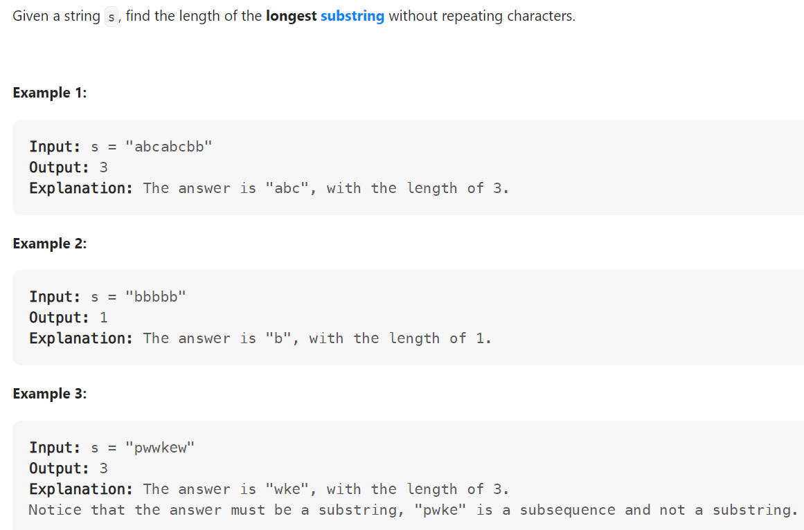

# Problem


# Solution ([Reference](https://youtu.be/wiGpQwVHdE0))
```python
class Solution:
    def lengthOfLongestSubstring(self, s: str) -> int:
        char_set = set()
        left = 0
        result = 0

        for right in range(len(s)):
            while s[right] in char_set: 
                # A duplicate, shrink our window from the left
                char_set.remove(s[left])
                left += 1

            # We've removed all duplicates in the substring
            char_set.add(s[right])
            result = max(result, right - left + 1)

        return result
```

# Complexity
```
Time = O(N)
Space = O(1)

# N = len(s)
```