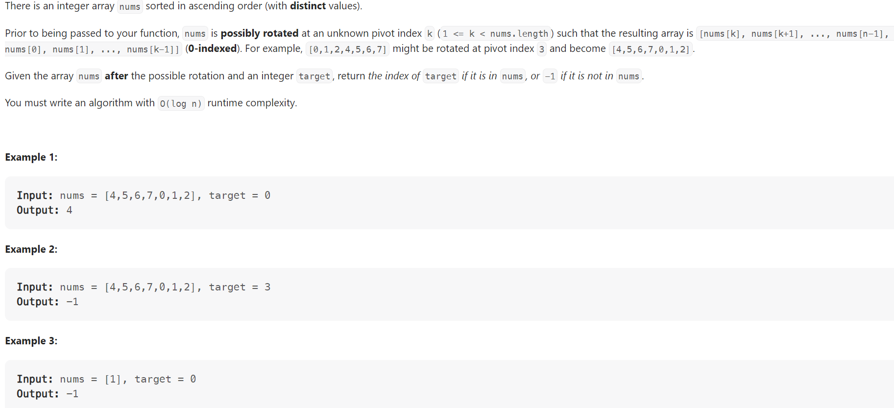

# Problem


# Solution ([Reference](https://youtu.be/U8XENwh8Oy8))
```python
class Solution:
    def search(self, nums: List[int], target: int) -> int:
        left, right = 0, len(nums) - 1

        while left + 1 < right:
            mid = (left + right) >> 1

            if nums[mid] == target:
                # We found our target
                return mid
            
            if nums[mid] >= nums[left]:
                # In the LEFT sorted portion
                if target > nums[mid] or target < nums[left]:
                    left = mid
                else:
                    right = mid
            else:
                # In the RIGHT sorted portion
                if target < nums[mid] or target > nums[right]:
                    right = mid
                else:
                    left = mid
        
        if target == nums[left]:
            return left
        elif target == nums[right]:
            return right
        else:
            return -1
```

# Complexity
```
Time = O(N)
Space = O(1)

# N = len(nums)
```