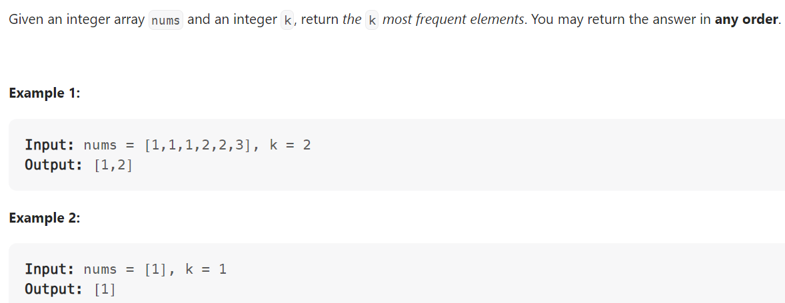

# Problem


# Solution ([Reference](https://youtu.be/YPTqKIgVk-k))
```python
class Solution:
    def topKFrequent(self, nums: List[int], k: int) -> List[int]:

        """
        Alternative Solution:
            >> Using Counter().most_common(k)
        """

        # Bucket Sort
        cnt = collections.Counter(nums)
        freq = [[] for _ in range(len(nums) + 1)]

        for num, count in cnt.items():
            freq[count].append(num)
        
        result = []
        for count in range(len(nums), 0, -1):
            # Iterate in descending order, from most frequent elements
            for num in freq[count]:
                result.append(num)
                if len(result) == k:
                    # We have reached the requirement
                    return result
```

# Complexity
```
Time = O(N)
Space = O(N)

# N = len(nums)
```