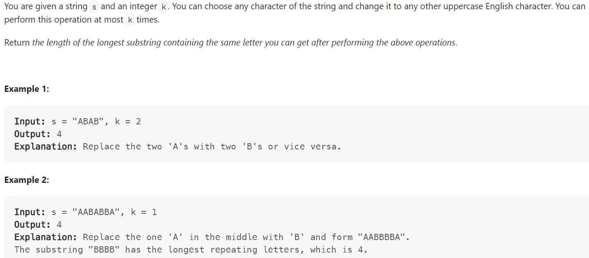

# Problem


# Solution ([Reference](https://youtu.be/gqXU1UyA8pk))
```python
class Solution:
    def characterReplacement(self, s: str, k: int) -> int:
        count = {} # {char: frequency it appeared in window}
        result = 0
        
        left = 0
        for right in range(len(s)):
            count[s[right]] = 1 + count.get(s[right], 0)

            while (right - left + 1) - max(count.values()) > k:
                # Number of replacements = window size - most frequency
                # If exceeds that allowed, shrink the window from the left
                count[s[left]] -= 1
                left += 1

            result = max(result, right - left + 1)
        return result
```

# Complexity
```
Time = O(N)

# N = len(s)
```