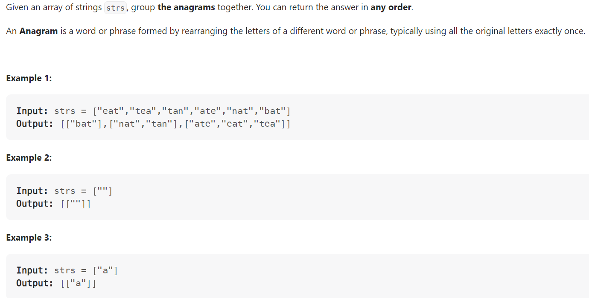

# Problem


# Solution ([Reference](https://youtu.be/vzdNOK2oB2E))
```python
class Solution:
    def groupAnagrams(self, strs: List[str]) -> List[List[str]]:
        hashmap = collections.defaultdict(list)

        for s in strs:
            hashed = [0] * 26
            for char in s:
                hashed[ord(char) - ord('a')] += 1
            # Note the use of tuple (since we cannot hash a list)
            hashmap[tuple(hashed)].append(s)
        
        return hashmap.values()
```

# Complexity
```
Time = O(M * N)

# M = len(strs), N = average length of a string
```