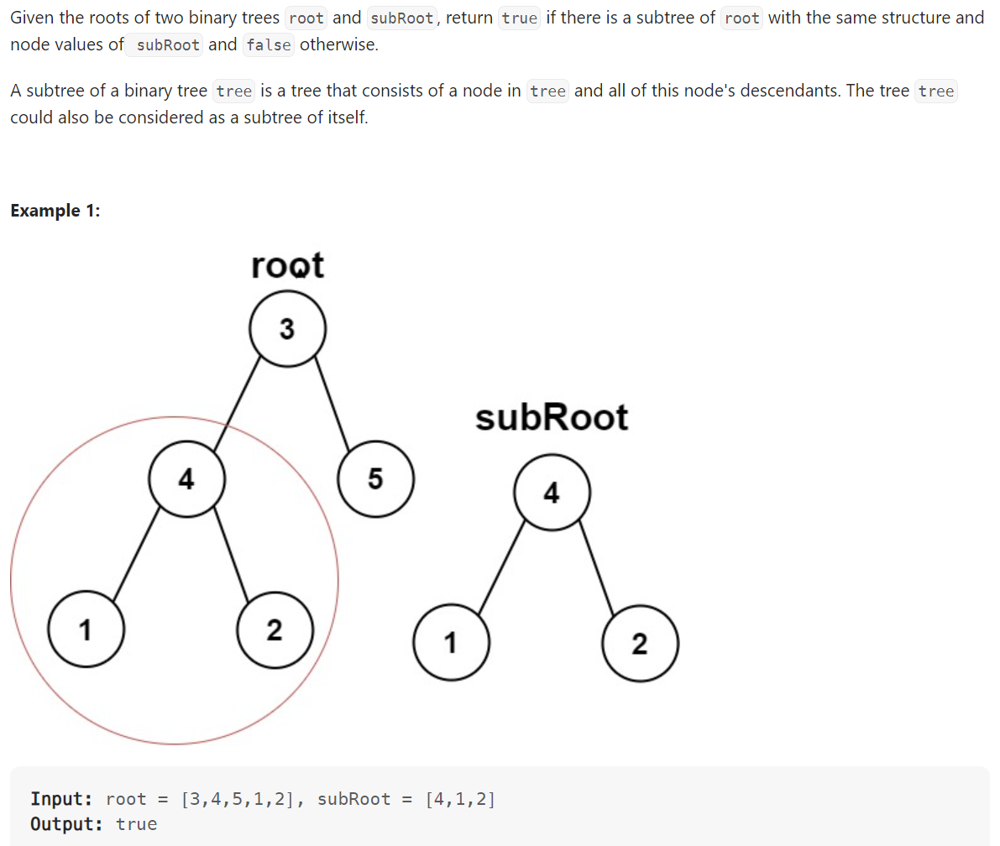

# Problem


# Solution ([Reference](https://youtu.be/E36O5SWp-LE))
```python
# Definition for a binary tree node.
# class TreeNode:
#     def __init__(self, val=0, left=None, right=None):
#         self.val = val
#         self.left = left
#         self.right = right
class Solution:
    def isSubtree(self, root: Optional[TreeNode], subRoot: Optional[TreeNode]) -> bool:
        if not subRoot:
            # Null is always a subtree
            return True
        if not root:
            # If subRoot is not Null and root is Null, cannot be a subtree
            return False
        
        if self.sameTree(root, subRoot):
            return True
        else:
            # See if it subRoot a subtree on the left OR on the right
            return self.isSubtree(root.left, subRoot) or self.isSubtree(root.right, subRoot)

    def sameTree(self, s, t):
        # See LeetCode 100: Same Tree
        if not s and not t:
            return True
        if not s or not t:
            return False
        if s.val != t.val:
            return False
        else:
            return self.sameTree(s.left, t.left) and self.sameTree(s.right, t.right)

```

# Complexity
```
Time = O(|root| * |subRoot|)
```