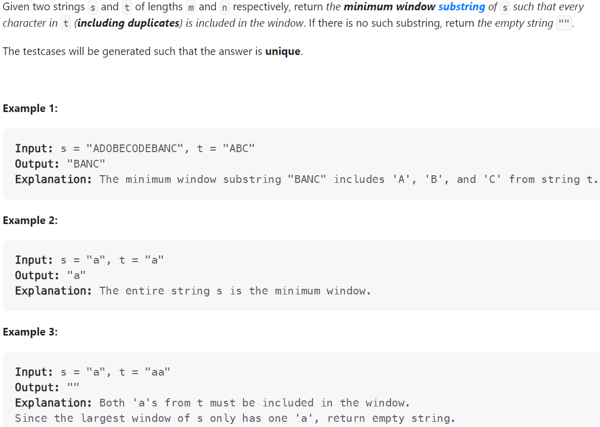

# Problem


# Solution ([Reference](https://youtu.be/jSto0O4AJbM))
```python
class Solution:
    def minWindow(self, s: str, t: str) -> str:
        if t == "": return ""

        result, result_len = [-1, -1], float('inf')
        count_t, count_window = {}, {}

        for c in t:
            count_t[c] = 1 + count_t.get(c, 0)
        
        have, need = 0, len(count_t)

        left = 0
        for right in range(len(s)):
            current_char = s[right]
            count_window[current_char] = 1 + count_window.get(current_char, 0)

            # Does window satisfy, for current character's count?
            if current_char in count_t and count_window[current_char] == count_t[current_char]:
                have += 1
            
            # Does window satisfy, for the entire target t?
            while have == need:
                # Update our result (keep minimum window that satisfies)
                if (right - left + 1) < result_len:
                    result = [left, right]
                    result_len = right - left + 1
                # Shrink window from left to find a potentially better result
                count_window[s[left]] -= 1
                if s[left] in count_t and count_window[s[left]] < count_t[s[left]]:
                    # The exclusion of the left character may change the satisfication of the window
                    have -= 1
                left += 1
        
        left, right = result
        # Note that there is a possibility that a result does not exist
        return s[left: right + 1] if result_len != float('inf') else ""
```

# Complexity
```
Time = O(N)

# N = len(s)
```