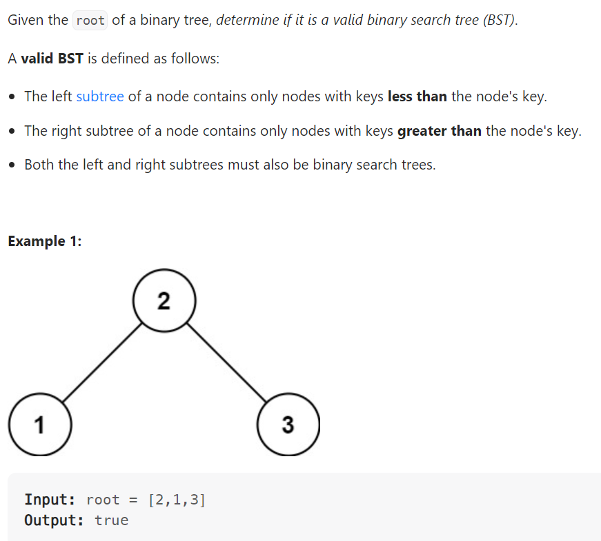

# Problem


# Solution ([Reference](https://youtu.be/s6ATEkipzow))
```python
# Definition for a binary tree node.
# class TreeNode:
#     def __init__(self, val=0, left=None, right=None):
#         self.val = val
#         self.left = left
#         self.right = right
class Solution:
    def isValidBST(self, root: Optional[TreeNode]) -> bool:
        return self.valid(root, float('-inf'), float('inf'))

    def valid(self, node, lower_bound, upper_bound):
            if not node:
                return True
            
            if node.val < lower_bound or node.val > upper_bound:
                return False
            
            return self.valid(node.left, lower_bound, node.val) and self.valid(node.right, node.val, upper_bound)
```

# Complexity
```
Time = O(N)

# N = number of nodes in the BST
```